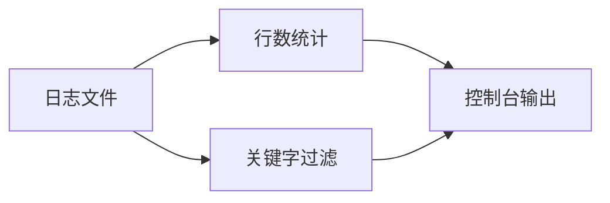
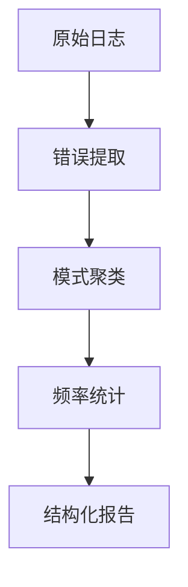
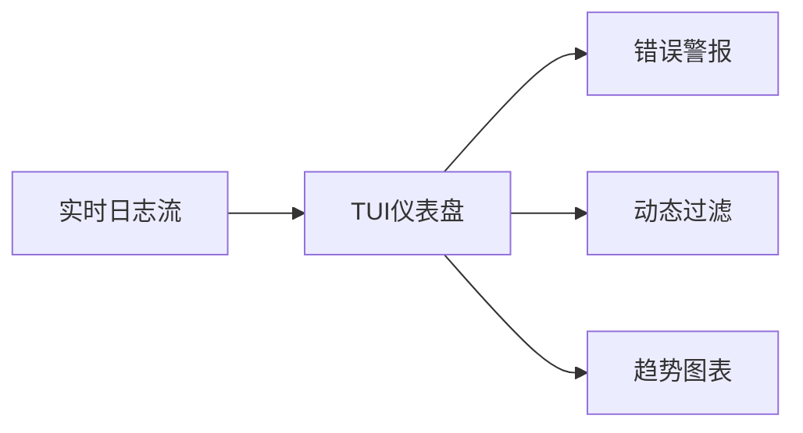

以下是 `logstat` 日志分析工具的**渐进式需求清单**，分为三个开发阶段，每个阶段都包含可验证的交付成果：

---

### **阶段1：基础核心功能 (1-2周)**
#### 核心目标：命令行日志统计工具


#### 功能需求：
1. **文件输入处理**
   - 支持单文件路径参数：`logstat path/to/file.log`
   - 支持通配符多文件：`logstat logs/*.log`
   - 支持标准输入流：`cat file.log | logstat -`

2. **基础统计功能**
   - 总行数统计（`--total`）
   - 匹配关键词的行数（`--filter "ERROR"`）
   - 支持多个过滤条件（`--filter "ERROR" --filter "WARN"`）

3. **输出控制**
   - 默认输出简洁摘要（文件路径 + 总行数 + 匹配数）
   - 详细模式（`-v`）显示每个文件的统计详情
   - 支持JSON格式输出（`--format json`）

4. **性能要求**
   - 处理100MB日志文件时间 < 1秒（SSD环境）
   - 内存占用 < 文件大小的10%

---

### **阶段2：智能分析增强 (2-3周)**
#### 核心目标：错误模式识别与聚合


#### 功能需求：
1. **错误模式识别**
   - 自动识别常见错误模式（正则预设）：
     - `ERROR: (\w+): (.+)`
     - `\[ERR\] (.+) at (.+:\d+)`
   - 支持自定义正则（`--pattern "custom_regex"`）

2. **智能聚类分析**
   - 按错误类型分组统计（如数据库超时/空指针）
   - 相同错误的上下文聚合（显示最近5条不同上下文）
   - 错误频率时序图（`--timeline`）

3. **高级过滤**
   - 时间范围过滤（`--start "2024-01-01" --end "2024-01-02"`）
   - 日志级别过滤（`--level error,warn`）
   - 反向过滤（`--exclude "DEBUG"`）

4. **报告生成**
   - HTML可视化报告（`--report report.html`）
   - 关键指标摘要：
     - 错误率 = 错误行数/总行数
     - 高频错误TOP 5

---

### **阶段3：交互式监控 (1-2周)**
#### 核心目标：实时日志监控仪表盘


#### 功能需求：
1. **实时监控模式**
   - 持续监听文件变化（`logstat monitor --watch file.log`）
   - 支持TCP/UDP日志流输入（`--tcp 127.0.0.1:8080`）

2. **终端用户界面(TUI)**
   - 四面板布局：
     ```bash
     +-----------------------+
     | 错误统计面板 (实时计数)  |
     +-----------------------+
     | 高频错误列表 (TOP 10)   |
     +-----------------------+
     | 原始日志预览 (可滚动)    |
     +-----------------------+
     | 筛选控制台 (动态过滤)   |
     +-----------------------+
     ```
   - 支持键盘快捷键：
     - `j/k`：滚动日志
     - `/`：激活搜索
     - `q`：退出

3. **警报系统**
   - 关键词命中通知（屏幕高亮 + 声音提示）
   - 错误率阈值警报（`--alert-rate 5%`）

4. **性能优化**
   - 增量处理：仅解析新日志行
   - 内存限制：自动清理历史数据（`--max-mem 100MB`）

---

### **非功能需求清单**
#### 1. **可靠性**
   - 处理畸形日志不崩溃（UTF-8校验跳过）
   - 文件锁定处理：当日志被其他进程写入时仍可读取

#### 2. **兼容性**
   | 系统        | 支持级别          |
   |------------|------------------|
   | Linux      | 完全支持（优先平台）|
   | macOS      | 完全支持          |
   | Windows    | 基础功能支持       |

#### 3. **易用性**
   - 智能默认值：无参数时自动分析当前目录最新日志
   - 上下文帮助：
     ```bash
     $ logstat --help
     [示例] logstat /var/log/app.log --filter "ERROR" --format json
     ```

#### 4. **可扩展性**
   - 插件接口设计（预留`plugins/`目录）
   - 配置文件支持（`~/.logstatrc`）

---

### **交付验证清单**
#### 阶段1验收标准：
- [ ] `logstat access.log` 输出文件行数
- [ ] `grep "404" access.log | logstat - --filter "404"` 正确统计
- [ ] `logstat *.log -v` 显示多文件详情

#### 阶段2验收标准：
- [ ] `logstat error.log --pattern "Timeout: (\d+)ms"` 提取超时数值
- [ ] `logstat app.log --timeline` 生成错误频率折线图
- [ ] `logstat --report out.html` 生成包含错误摘要的HTML

#### 阶段3验收标准：
- [ ] `logstat monitor --watch log.txt` 实时显示滚动日志
- [ ] 在TUI中按`/`输入`ERROR`后只显示错误行
- [ ] 错误率超过阈值时终端边框变红

---

### **技术栈选择建议**
| 模块              | 推荐库                  | 理由                     |
|-------------------|------------------------|--------------------------|
| 命令行解析        | `clap`                 | 功能最全，支持derive宏    |
| 日志解析          | `regex` + `nom`        | 正则+解析器组合覆盖复杂场景|
| 数据聚合          | `hashbrown`            | 高性能HashMap实现         |
| TUI渲染           | `ratatui` + `crossterm`| 活跃维护，跨平台支持好     |
| HTML报告          | `askama`               | 类型安全的模板引擎         |
| 异步文件监听      | `notify` + `tokio`     | 跨平台文件系统事件通知     |

---

### **立即行动步骤**
1. **创建项目骨架**：
   ```bash
   cargo new logstat
   cd logstat
   ```

2. **添加阶段1依赖**：
   ```toml
   [dependencies]
   clap = { version = "4.5", features = ["derive"] }
   anyhow = "1.0"    # 错误处理
   memmap2 = "0.9"   # 内存映射文件
   ```

3. **实现最小原型**（main.rs）：
   ```rust
   use clap::Parser;
   use std::path::PathBuf;

   #[derive(Parser)]
   struct Args {
       #[arg(required = true)]
       files: Vec<PathBuf>,
       
       #[arg(short, long)]
       filter: Option<String>,
   }

   fn main() -> anyhow::Result<()> {
       let args = Args::parse();
       for file in args.files {
           let content = std::fs::read_to_string(&file)?;
           let total_lines = content.lines().count();
           let filtered_count = match &args.filter {
               Some(f) => content.lines().filter(|l| l.contains(f)).count(),
               None => 0,
           };
           println!("{}: {} lines ({} matched)", 
                    file.display(), total_lines, filtered_count);
       }
       Ok(())
   }
   ```

4. **测试运行**：
   ```bash
   echo "Hello\nError: something" > test.log
   cargo run -- test.log --filter "Error"
   # 输出: test.log: 2 lines (1 matched)
   ```

**今晚即可完成阶段1的核心功能**！建议从统计单个文件开始，逐步扩展至通配符和多过滤条件。每完成一个小功能立即测试验证，保持快速迭代节奏。